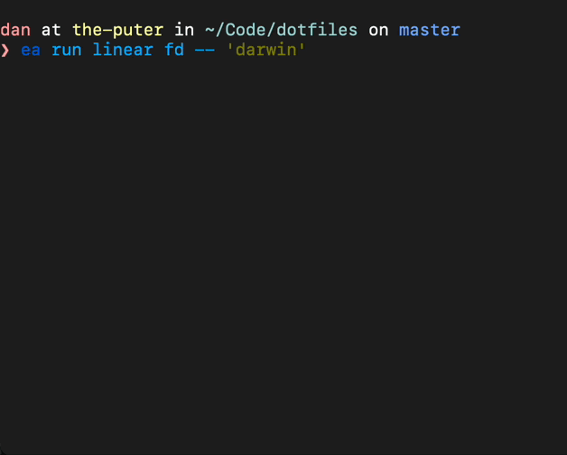

# ea: Making CLI Outputs Actionable

`ea` remembers file paths from CLI output for later use.

## Intro

CLI programs like `find`, `rg`, `clang` etc, print out file paths (and line/columns). `ea` lets you act on
them. Here's how:

By running your command through `ea`, each path in its output get marked with a number in the front. This
number can be used to retrieve its corresponding path later for your purposes. Combined with some shell
configurations, this can provide a powerful experience.

## Documentations

* [User Manual](docs/UserManual.md)
    * [Tutorial](docs/UserManual.md#description)
    * [Formats](docs/UserManual.md#formats)
    * [Shell Integration](docs/UserManual.md#shell-integration)
* [Note to packagers](docs/Packaging.md)

## Credits

`ea` is inspired by [keith/tag][], which was inspired by [aykamko/tag][].

[keith/tag]: https://github.com/keith/tag
[aykamko/tag]: https://github.com/aykamko/tag

## LICENSE

See `LICENSE.txt`.
